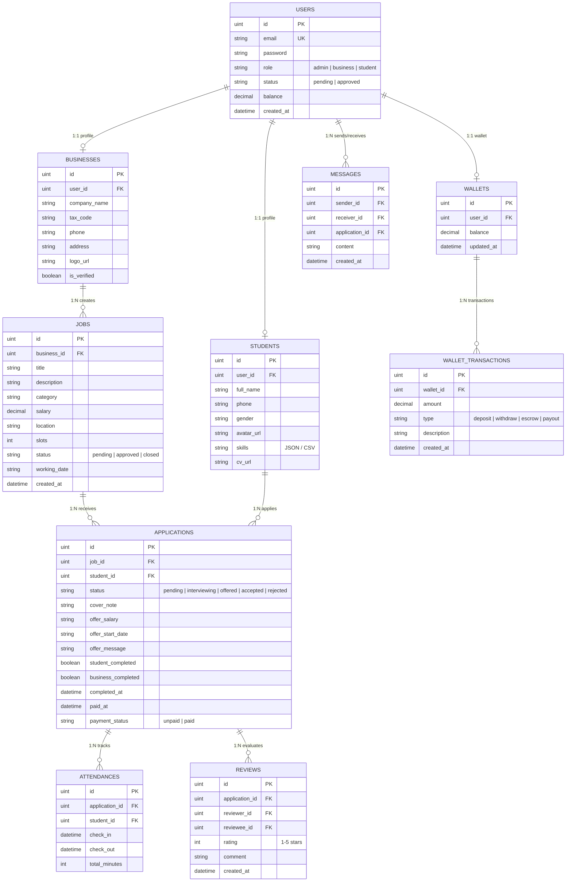

# QuickWork System — Sơ Đồ Thực Thể Liên Kết (Entity Relationship Diagram - ERD)

Tài liệu thiết kế Cơ sở dữ liệu và Sơ đồ thực thể liên kết (ERD) cho Hệ thống Tuyển dụng & Đánh giá CV AI QuickWork.

---

## 1. Sơ Đồ Thực Thể Liên Kết (Mermaid ERD Diagram)

---

## 2. Chi Tiết Các Bảng Dữ Liệu (Table Schema Details)

### 2.1. Bảng `users` (Tài khoản Người dùng)
- **`id`** (UINT, Primary Key, Auto Increment): Mã định danh duy nhất.
- **`email`** (VARCHAR(100), Unique, Not Null): Địa chỉ email đăng nhập.
- **`password`** (VARCHAR(255), Not Null): Mật khẩu đã mã hóa Bcrypt.
- **`role`** (VARCHAR(20), Not Null): Vai trò (`admin`, `business`, `student`).
- **`status`** (VARCHAR(20), Default: 'pending'): Trạng thái phê duyệt tài khoản.
- **`balance`** (DECIMAL(15,2), Default: 0.00): Số dư tài khoản chính.

### 2.2. Bảng `students` (Hồ sơ Sinh viên)
- **`id`** (UINT, Primary Key): Mã hồ sơ sinh viên.
- **`user_id`** (UINT, Foreign Key -> `users.id`, Unique): Liên kết 1:1 với tài khoản User.
- **`full_name`** (VARCHAR(100), Not Null): Họ và tên đầy đủ.
- **`phone`** (VARCHAR(20)): Số điện thoại liên hệ.
- **`gender`** (VARCHAR(10)): Giới tính.
- **`skills`** (TEXT): Danh sách kỹ năng (Định dạng Mảng JSON hoặc Chuỗi phân cách dấu phẩy).
- **`cv_url`** (VARCHAR(255)): Đường dẫn tệp tin CV PDF.

### 2.3. Bảng `businesses` (Hồ sơ Doanh nghiệp)
- **`id`** (UINT, Primary Key): Mã doanh nghiệp.
- **`user_id`** (UINT, Foreign Key -> `users.id`, Unique): Liên kết 1:1 với tài khoản User.
- **`company_name`** (VARCHAR(255), Not Null): Tên công ty/doanh nghiệp.
- **`tax_code`** (VARCHAR(50)): Mã số thuế.
- **`phone`** (VARCHAR(20)): Số điện thoại doanh nghiệp.
- **`address`** (VARCHAR(255)): Địa chỉ trụ sở/chi nhánh.
- **`is_verified`** (BOOLEAN, Default: false): Cờ xác thực từ Admin.

### 2.4. Bảng `jobs` (Tin tuyển dụng)
- **`id`** (UINT, Primary Key): Mã tin tuyển dụng.
- **`business_id`** (UINT, Foreign Key -> `businesses.id`): Doanh nghiệp đăng tin.
- **`title`** (VARCHAR(255), Not Null): Tiêu đề công việc.
- **`description`** (TEXT): Mô tả chi tiết nhiệm vụ và yêu cầu.
- **`category`** (VARCHAR(100)): Phân loại ngành nghề (IT, F&B, Marketing...).
- **`salary`** (DECIMAL(15,2)): Mức lương đề xuất.
- **`location`** (VARCHAR(255)): Địa điểm làm việc.
- **`status`** (VARCHAR(20)): Trạng thái tin (`pending`, `approved`, `closed`).

### 2.5. Bảng `applications` (Đơn Ứng tuyển & Hợp đồng Công việc)
- **`id`** (UINT, Primary Key): Mã đơn ứng tuyển.
- **`job_id`** (UINT, Foreign Key -> `jobs.id`): Bài đăng tuyển dụng.
- **`student_id`** (UINT, Foreign Key -> `students.id`): Sinh viên ứng tuyển.
- **`status`** (VARCHAR(20)): Trạng thái (`pending`, `interviewing`, `offered`, `accepted`, `rejected`).
- **`offer_salary` & `offer_start_date`**: Điều khoản Offer từ nhà tuyển dụng.
- **`payment_status`**: Trạng thái thanh toán lương Escrow (`unpaid`, `paid`).

---

## 3. Các Luồng Quan Hệ Nghiệp Vụ (Business Logic Relations)

1. **Xác thực & Phân quyền (Auth & Profile):**
   - 1 `User` tương ứng 1 `Student` hoặc 1 `Business` (Quan hệ 1:1 qua `user_id`).
2. **Tuyển dụng & Ứng tuyển (Job & Application):**
   - 1 `Business` có thể đăng nhiều `Job` (Quan hệ 1:N).
   - 1 `Student` có thể nộp đơn ứng tuyển cho nhiều `Job` khác nhau (Tạo thành bản ghi trong `APPLICATIONS`).
3. **Theo dõi Ca làm & Điểm danh (Attendance):**
   - Mỗi hợp đồng công việc `Application` ghi nhận các lượt Check-in/Check-out hàng ngày trong bảng `ATTENDANCES`.
4. **Ví tiền & Giao dịch (Escrow Wallet):**
   - Mỗi `User` sở hữu 1 `Wallet` lưu số dư tiền thực tế và lịch sử các giao dịch nạp/rút/trả lương `WALLET_TRANSACTIONS`.
